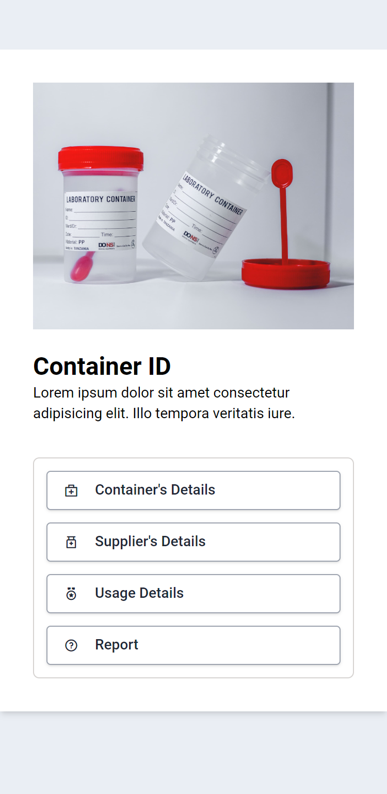
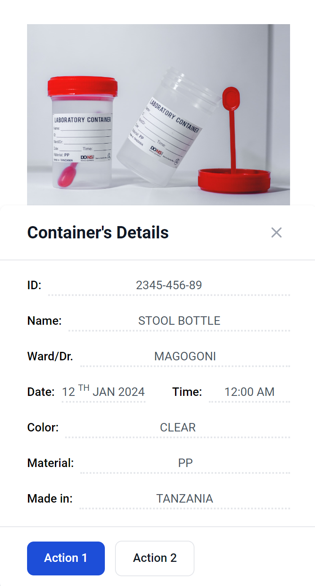

# Medical Laboratory Scan

A user-friendly, web-based medical laboratory scan application.

## Preview

|                    |                     |
| :----------------: | :-----------------: |
|  |  |

Live [Demo](https://theomaro.github.io/medical-lab-scan/)

## Testing

- Clone the project

```npm
git clone https://github.com/theomaro/medical-lab-scan.git
cd medical-lab-scan
```

- Install packages

```npm
npm install
```

- Watch Tailwind and TypeScript files

```npm
npm run tail-w
npm run tsc-w
```
